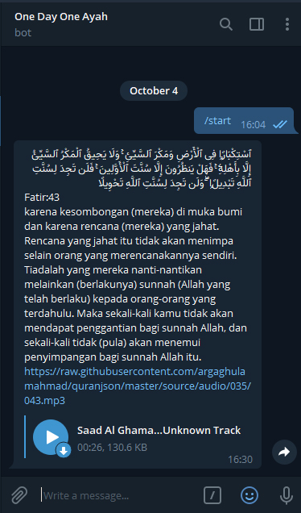

# One Day One Ayah




Send 5 times message that contains the quran verse and translation to your telegram bot.

The `odoa` python script taken from https://github.com/Keda87/python-quran-odoa/blob/master/odoa.py.

### Why?
#### Telegram?
The easiest instant messaging app bot to configure
#### Build this bot?
At least learn quran one verse a day.
#### Github Action?
- Github action provide pipeline that free to use without limit as long the repo visibility is public
- Can triggered with cron (linux time scheduler)
#### Learning purpose
- Learn how to utilize github action
- Discover interesting github action that develop by community
- Develop telegram bot

### Make it your own
#### Clone this repo

```bash
git clone https://github.com/argaghulamahmad/one-day-one-ayah.git
```

#### [Create a new repo on your github account.](https://help.github.com/en/github/creating-cloning-and-archiving-repositories/creating-a-new-repository)
#### [Create your own telegram bot.](https://core.telegram.org/bots)
#### [Enter the following secrets to your github repo secrets](https://help.github.com/en/actions/configuring-and-managing-workflows/creating-and-storing-encrypted-secrets)

```
// Telegram chat id and your telegram bot token
// For further information, read README of the repo below
// https://github.com/appleboy/telegram-action

TELEGRAM_TO     // chat id with bot
TELEGRAM_TOKEN  // telegram api token
```

```
// Your name and your github email for commit loggin purpose

email           // your github email
name            // your name
```

#### Push to your own repo
Remove the current remote origin and add your repo as remote origin
```
git remote remove origin
git remote add origin <your-github-repo>
```
Push to your own repo
```
git push origin master
```

## Built With

* [Github Actions](https://github.com/features/actions) - Github actions
* [Python](https://www.python.org/) - Python programming language
* [telegram-action](https://github.com/appleboy/telegram-action) - Github action to send telegram message

### How-to? Run sso-login script locally

Install everything that needed to run the script
```
pip install -r requirements.txt
```

Run the sso-login script
```
python main.py
```

## References

* https://help.github.com/en/actions/configuring-and-managing-workflows/configuring-a-workflow
* https://help.github.com/en/actions/language-and-framework-guides/using-python-with-github-actions
* https://help.github.com/en/actions/configuring-and-managing-workflows/using-environment-variables
* https://help.github.com/en/actions/configuring-and-managing-workflows/creating-and-storing-encrypted-secrets

## Authors

* **Arga Ghulam Ahmad** - *Initial work* - [@argaghulamahmad/sso-ui-renew-notice](https://github.com/argaghulamahmad/sso-ui-renew-notice)